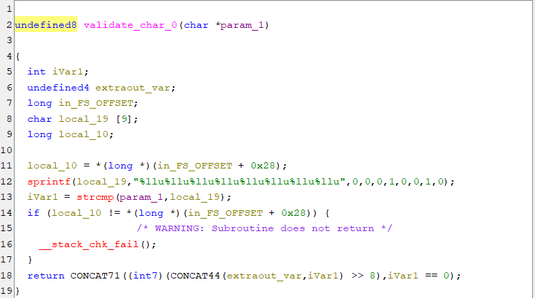

# Binary Flag Checker Reverse Engineering Write-up

## Challenge Information

**Title:** gedebug    
**Description:** yet another flag checker program  

## Initial Analysis

### Binary Examination with Ghidra


After importing the binary into Ghidra and decompiling it, I found that the `main()` function checks user input through the `check_char()` function.

### Understanding the Validation Process


The `check_char()` function:
1. Receives user input
2. Converts each character to binary using `char_to_rev_binary()`
3. Runs a series of validations for each character (`validate_char_0` through `validate_char_64`)

## Reverse Engineering Approach

### Binary Conversion Analysis


By examining the `char_to_rev_binary()` function, I discovered that this function could be reversed to extract the binary values that correspond to the validations in the `check_char()` function.

### Extracting Validation Patterns



I extracted the binary values from `validate_char_0` through `validate_char_64` and created a mapping of each character position to its expected binary pattern.

## Solution Implementation

### Validation Pattern Mapping

```python
    0: "00010010",   # validate_char_0: 0,0,0,1,0,0,1,0
    1: "10010110",   # validate_char_1: 1,0,0,1,0,1,1,0
    2: "01000010",   # validate_char_2: 0,1,0,0,0,0,1,0
    3: "01001100",   # validate_char_3: 0,1,0,0,1,1,0,0
    4: "10101100",   # validate_char_4: 1,0,1,0,1,1,0,0
    5: "11011110",   # validate_char_5: 1,1,0,1,1,1,1,0
    6: "00011010",   # validate_char_6: 0,0,0,1,1,0,1,0
    7: "00001100",   # validate_char_7: 0,0,0,0,1,1,0,0
    8: "01001110",   # validate_char_8: 0,1,0,0,1,1,1,0
    9: "11111010",   # validate_char_9: 1,1,1,1,1,0,1,0
    10: "00011110",  # validate_char_10: 0,0,0,1,1,1,1,0
    11: "00001100",  # validate_char_11: 0,0,0,0,1,1,0,0
    12: "01001010",  # validate_char_12: 0,1,0,0,1,0,1,0
    13: "11111010",  # validate_char_13: 1,1,1,1,1,0,1,0
    14: "00011010",  # validate_char_14: 0,0,0,1,1,0,1,0
    15: "11110010",  # validate_char_15: 1,1,1,1,0,0,1,0
    16: "01001010",  # validate_char_16: 0,1,0,0,1,0,1,0
    17: "11111010",  # validate_char_17: 1,1,1,1,1,0,1,0
    18: "00101010",  # validate_char_18: 0,0,1,0,1,0,1,0
    19: "00010110",  # validate_char_19: 0,0,0,1,0,1,1,0
    20: "11001100",  # validate_char_20: 1,1,0,0,1,1,0,0
    21: "11111010",  # validate_char_21: 1,1,1,1,1,0,1,0
    22: "01000010",  # validate_char_22: 0,1,0,0,0,0,1,0
    23: "11001100",  # validate_char_23: 1,1,0,0,1,1,0,0
    24: "11001110",  # validate_char_24: 1,1,0,0,1,1,1,0
    25: "00101110",  # validate_char_25: 0,0,1,0,1,1,1,0
    26: "11111010",  # validate_char_26: 1,1,1,1,1,0,1,0
    27: "00110010",  # validate_char_27: 0,0,1,1,0,0,1,0
    28: "00001100",  # validate_char_28: 0,0,0,0,1,1,0,0
    29: "11100010",  # validate_char_29: 1,1,1,0,0,0,1,0
    30: "10001100",  # validate_char_30: 1,0,0,0,1,1,0,0
    31: "11000010",  # validate_char_31: 1,1,0,0,0,0,1,0
    32: "11111010",  # validate_char_32: 1,1,1,1,1,0,1,0
    33: "11110010",  # validate_char_33: 1,1,1,1,0,0,1,0
    34: "00001010",  # validate_char_34: 0,0,0,0,1,0,1,0
    35: "11001100",  # validate_char_35: 1,1,0,0,1,1,0,0
    36: "01001010",  # validate_char_36: 0,1,0,0,1,0,1,0
    37: "00101100",  # validate_char_37: 0,0,1,0,1,1,0,0
    38: "00101010",  # validate_char_38: 0,0,1,0,1,0,1,0
    39: "10001100",  # validate_char_39: 1,0,0,0,1,1,0,0
    40: "11110010",  # validate_char_40: 1,1,1,1,0,0,1,0
    41: "01110010",  # validate_char_41: 0,1,1,1,0,0,1,0
    42: "11111010",  # validate_char_42: 1,1,1,1,1,0,1,0
    43: "01100010",  # validate_char_43: 0,1,1,0,0,0,1,0
    44: "00001100",  # validate_char_44: 0,0,0,0,1,1,0,0
    45: "01001010",  # validate_char_45: 0,1,0,0,1,0,1,0
    46: "11111010",  # validate_char_46: 1,1,1,1,1,0,1,0
    47: "00010010",  # validate_char_47: 0,0,0,1,0,0,1,0
    48: "00101100",  # validate_char_48: 0,0,1,0,1,1,0,0
    49: "11000010",  # validate_char_49: 1,1,0,0,0,0,1,0
    50: "11010010",  # validate_char_50: 1,1,0,1,0,0,1,0
    51: "11001100",  # validate_char_51: 1,1,0,0,1,1,0,0
    52: "01001010",  # validate_char_52: 0,1,0,0,1,0,1,0
    53: "11001010",  # validate_char_53: 1,1,0,0,1,0,1,0
    54: "10101100",  # validate_char_54: 1,0,1,0,1,1,0,0
    55: "11001010",  # validate_char_55: 1,1,0,0,1,0,1,0
    56: "10101100",  # validate_char_56: 1,0,1,0,1,1,0,0
    57: "11001010",  # validate_char_57: 1,1,0,0,1,0,1,0
    58: "10101100",  # validate_char_58: 1,0,1,0,1,1,0,0
    59: "11001010",  # validate_char_59: 1,1,0,0,1,0,1,0
    60: "10101100",  # validate_char_60: 1,0,1,0,1,1,0,0
    61: "10000100",  # validate_char_61: 1,0,0,0,0,1,0,0
    62: "10000100",  # validate_char_62: 1,0,0,0,0,1,0,0
    63: "10000100",  # validate_char_63: 1,0,0,0,0,1,0,0
    64: "10111110",  # validate_char_64: 1,0,1,1,1,1,1,0
```

## Solution Process

### Understanding the Binary Encoding

The `char_to_rev_binary()` function converts each ASCII character to a reversed binary representation. By understanding this encoding scheme, I could reverse the process.

### Pattern Extraction

```python
def reversed_binary_to_char(rev_binary_str):
    decimal_value = 0
    for i, bit in enumerate(rev_binary_str):
        if bit == '1':
            decimal_value += 2 ** i
    
    return chr(decimal_value)
```
For each character position (0-64), I extracted the expected binary pattern from the corresponding validation function. Each validation function checks if the binary representation of the input character matches a specific 8-bit pattern.

### Flag Reconstruction

```python
flag = ""
for i in sorted(patterns.keys()):
    char = reversed_binary_to_char(patterns[i])
    flag += char

print(flag)
```
Using the extracted patterns, I converted each binary string back to its corresponding ASCII character, building the flag character by character.

## Flag

```
HiB25{X0r_x0R_XOR_Th3_B3st_L0G1C_OP3R4T1ON_F0R_H4CK3RS5S5S5S5!!!}
```

## Summary

This challenge demonstrated:

1. **Binary Analysis** - Using Ghidra for disassembly and decompilation
2. **Function Analysis** - Understanding character validation mechanisms
3. **Binary Encoding** - Reverse engineering custom binary representation schemes
4. **Pattern Recognition** - Extracting validation patterns from multiple functions
5. **Data Reconstruction** - Converting binary patterns back to ASCII characters

The challenge required careful analysis of how the program validates each character position through individual validation functions. By extracting the expected binary patterns and reversing the encoding process, the flag could be reconstructed without needing to brute force or guess the input.

The flag appropriately celebrates XOR operations, which are fundamental in both cryptography and reverse engineering challenges.